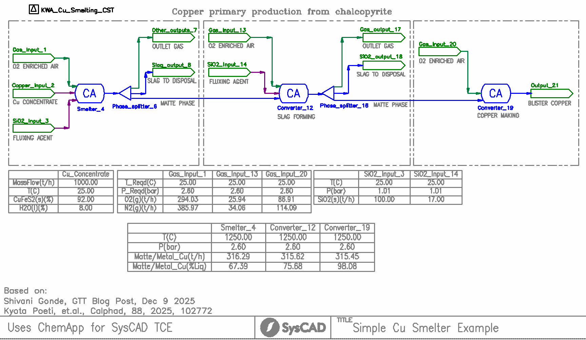
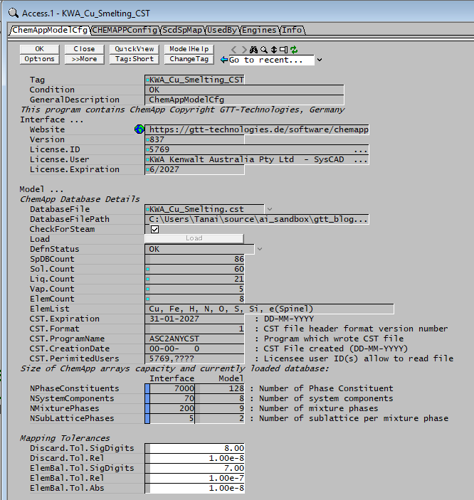
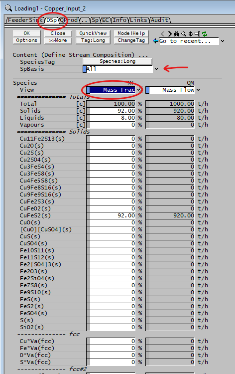
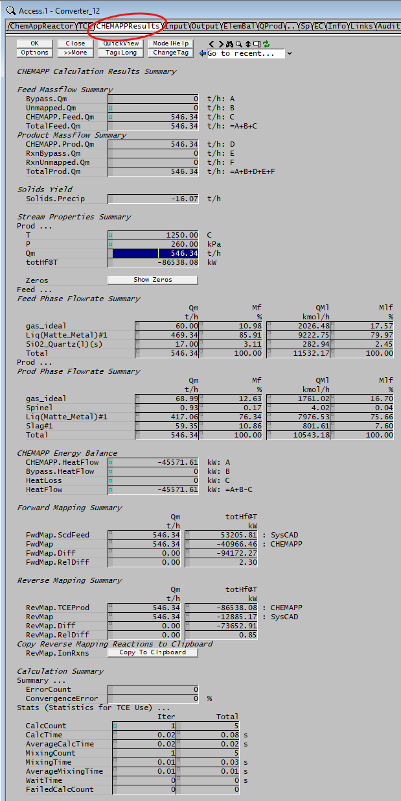
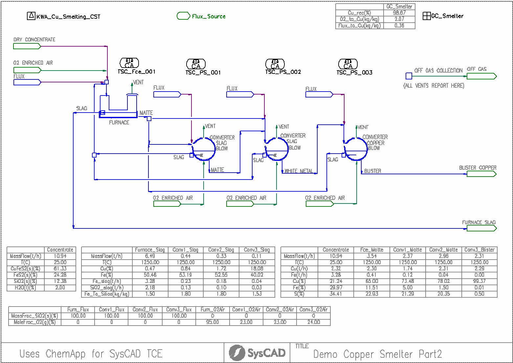
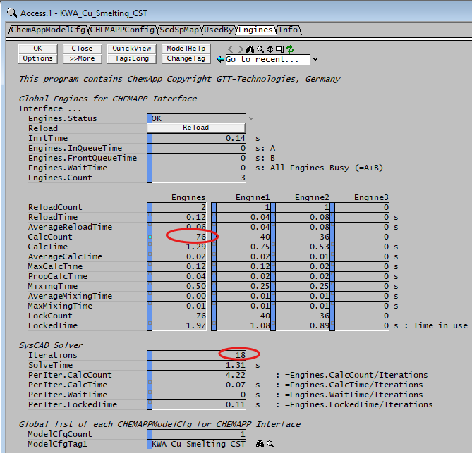

# ChemApp for SysCAD Examples

Examples using the SysCAD Process Simulation Software and ChemApp for SysCAD variant of ChemApp

## Using the Examples

Each example is provided as a SysCAD Project, typically contained in a SysCAD Project Group Folder. for example:

**CA_for_SysCAD\Copper\Demo_Copper_Smelter_Part1.spf**

with a configuration folder:

**CA_for_SysCAD\Copper\CfgFiles**

and a ChemApp cst file:

**CA_for_SysCAD\Copper\CfgFiles\CSTFile\KWA_Cu_Smelting.cst**

Both the SysCAD Project folder and the Configuration folder must be contained in the Group folder. Multiple Project folders can use a common configuration folder.

**License requirements:** To open and solve these examples, the following licenses are required:

- **SysCAD** Steady State Solver, with Energy Balance, Integrated Libraries and [**TCE Add-on**](https://help.syscad.net/SysCAD_Structure#TCE_(Thermodynamic_Calculation_Engines)_Add-On)
  - a temporary [**SysCAD Trial**](https://www.syscad.net/download-trial/) license also allows opening and executing these examples.
- [**ChemApp for SysCAD**](https://gtt-technologies.de/software/chemapp/chemapp-for-syscad/) license from GTT Technologies

## Examples Documentation

Description for examples in this repo and other SysCAD Projects using ChemApp for SysCAD can be found here: [ChemApp for SysCAD Example Projects - SysCAD Documentation](https://help.syscad.net/Example_-_07_ChemApp_Projects)

## List of Examples

Current published examples and brief descriptions of how to use.

### Demo Copper Smelter Part1
- Group folder: Copper
- Configuration folder: Copper\CfgFiles
- Project folder: Copper\Demo Copper Smelter Part1.spf
- ChemApp cst file: KWA_Cu_Smelting.cst all user-id's, expires 31-01-2027

This example demonstrate a basic flowsheet using ChemApp reactors to simulate Copper smelting process.

*Figure 1: Copper primary production from chalcopyrite - SysCAD flowsheet using ChemApp for SysCAD TCE Add-on (Simple Cu Smelter Example)*

**Open and load the example**
- Start SysCAD, select *Open Project* from the main *File* menu
- Navigate to the SysCAD Project folder: *Copper\Demo Copper Smelter Part1.spf\\*
- Select *Project.spj* and click *Open*

**Navigating the model and accessing parameters**
- ***right click*** in any object in the graphics page. An *Access Window* will open containing relevant information for that object
- white fields are editable, grey fields are calculated read-only values. Example of Model Configuration unit ***KWA_Cu_Smelting_CST***:

- Example of changing feed composition. *right-click* on ***Copper_Input_2*** feeder unit. Select ***DSp*** tab in Access Window:

  - You can select how to express the composition: *Mass Fraction*, *Mass Flow* or *molar basis* using the highlighted dropdown menu in *Species View*

  - Entering values in any white field will temporary change the values and then pressing OK will validate and if necessary recalculate the values (if there is a need to normalize or ajust total to be 100%)

  - Note that you can select SpBasis to: All, Phase or Individual Phase. which will display fractions on a global scale (all phases), on a per-phase (solid, liquid or gas) basis or on the basis of individual phases (slag, matte, gas, solid solutions).

- Solve the model: once you have set all the input conditions by editing parameters in different Access Windows, press ***Run*** on the main toolbar or selecting ***Actions*** from the main menu and then ***Run (Ctrl+Shift+R)***

**Review Results**

All results can be manually reviewed through access windows, right-click on any object (Reactor, pipe, sink, etc.), navigate through the tabs and look at the calculated values.

- For ChemApp specific results, you can examine the ChemApp Reactor units, i.e. *Smelter_4*, *Converter_12* and *Converter_19*
right-clink on any of these units and select the ***ChemAppResults*** tab:

- The Input and Output tabs show more details of the mixed feed stream passed on to ChemApp, using the cst phase and phase constituent definition and the equilibrium result from the ChemApp calculation
- Additional information such as calculation time, number of ChemApp calls to this unit, etc. are also given

- For SysCAD specific results, you can right-click on any pipe and look at the Sp or EC tab pages. You will notice that the naming of species is slightly different than in the ChemApp Input and Output tabs. This is because SysCAD automatically maps species in its own database to those defined in the ChemApp cst file. This is donw on the feed and product sides of the ChemApp reactor (forward and reverse mapping, respectively)

---

### Demo Copper Smelter Part2
- Group folder: Copper
- Configuration folder: Copper\CfgFiles
- Project folder: Copper\Demo Copper Smelter Part1.spf
- ChemApp cst file: KWA_Cu_Smelting.cst all user-id's, expires 31-01-2027

This example demonstrate the use of recycling streams and how SysCAD automatically detects and handle convergence of recirculations.

*Figure 2: Copper primary production from chalcopyrite - SysCAD flowsheet using ChemApp for SysCAD TCE Add-on (Copper Smelter with Slag Recirculation)*

In this example, slag from the first two converter stages (slag blow 1 and 2) are recycled back to the furnace instead of being discarded. Also, residue from the last converter stage (copper blow) is recycled back to the first slag blow.

SysCAD automatically detects this recycling streams using a tear solver. This is an iterative solution and SysCAD will converge to a steady state automatically when solving the model without the need to initialize recirculations or having to set a number of iterations.

To test solving the model from a reset state (from scratch), follow this steps:
- Make sure graphic window is active. Click anywhere in the graphics page
- Go to main menu *Actions* and select *Reset (Ctrl+Shift+Z)*
- *Run* the model

Resetting the model "empties" all the results from all objects, only keeping user specified parameters (feed amount, composition, equilibrium conditions, etc.)

In this example, SysCAD requires 18 global iterations to solve from a reset state during which, sevarl (76) calls to ChemApp are made (there are four ChemApp reactors and four ChemApp SideCalc units)

You can view ChemApp specific stats by right-click on the KWA_Cu_Smelting_CST model configuration unit

Also, note that although 76 total calls to ChemApp equilibrium were made, SysCAD automatically parallelized the flow network into two main threads and therefore used two parallel ChemApp instances, sharing the load of calls between the two.

---

*For more information on SysCAD and the TCE Add-on with ChemApp for SysCAD, visit [www.syscad.net](https://www.syscad.net) and [gtt-technologies.de](https://gtt-technologies.de).*